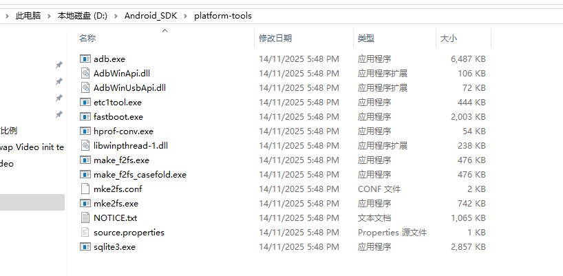
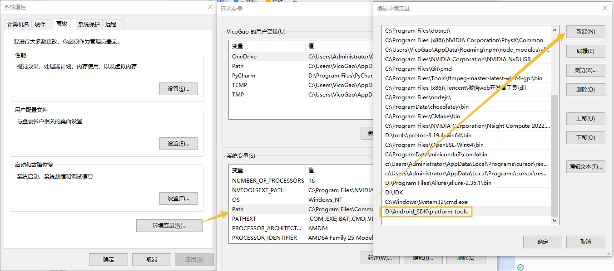
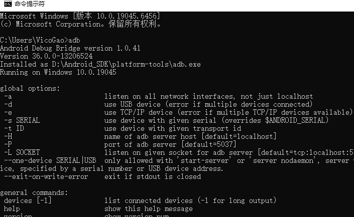

ndroid SDK Platform-Tools 是 Android SDK 的一个组件。它包含与 Android 平台进行交互的工具，主要是 adb 和 fastboot。虽然 adb 是 Android 应用开发所必需的，但应用开发者通常仅使用 Studio 安装的副本。如果您想直接从命令行使用 adb 并且未安装 Studio，此项下载非常有用。

### 下载解压
[官网下载链接](https://developer.android.com/tools/releases/platform-tools?hl=zh-cn)  
解压到本地目录：

### 配置环境变量

### 测试
