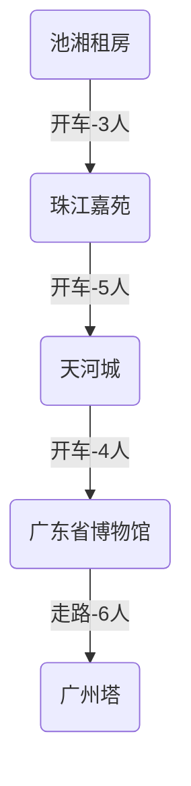
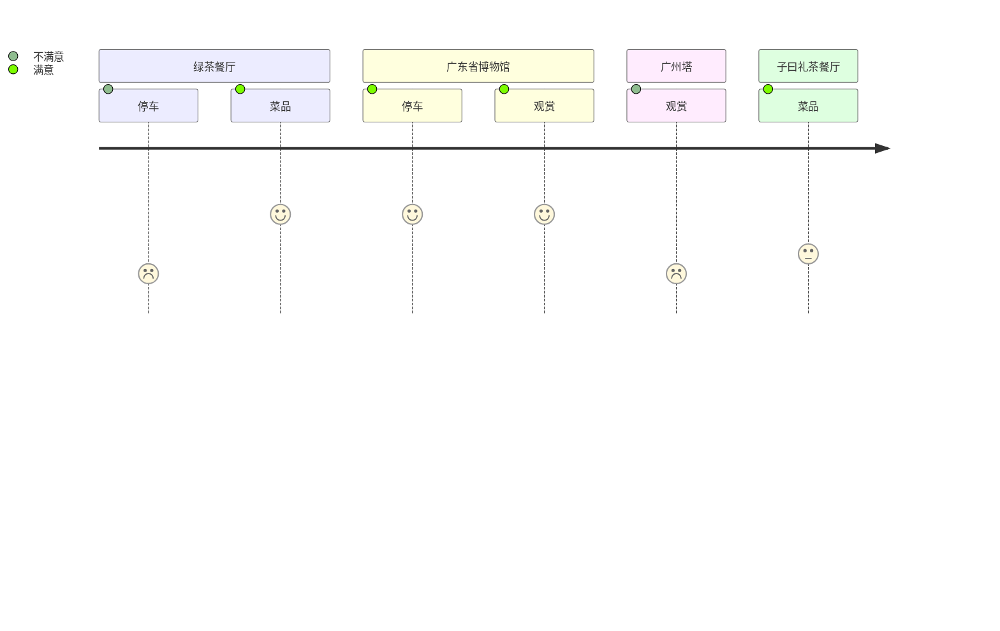



<!-- node 2025.03.03 -->
买二手车：马自达3 昂克赛拉
最便宜配置：2024款 1.5L 自动舒适 三厢 红色

<!-- node 2025.03.04 -->
退税计算：
不超过36000元的部分 3%
超过36000元至144000元的部分 10%
超过144000元的部分至300000元的部分 20%
...
速算扣除数
0、2520、16920
速算扣除数是怎么来的?假设你的全年累计应纳税所得额为4万，不用速算扣除，就要分段计算，算法:36000x3%+(4万-36000)x10%
算式变形如下
36000x3%+(4万-36000)x10%=36000x3%+4万x10%-36000x10%=4万x18%+36000x3%-36000x18%=4万x10%+36000x(3%-10%)
=4万x10%+36800(-7%)
=4万x10%-36000x7%
=4万x10%-2520

年终奖金不超过36000，选择单独计税。

今年退税金额有￥1800，爽歪歪。

<!-- node 2025.03.05 -->
在懂车帝上看的两辆昂克赛拉，茂名水东的。
白色 2014款 15年上牌 1.5L 自动舒适版 3.28W
红色 2016款 16年上牌 1.5L 自动尊贵版 3.88W
叫爸去看车，最后定下来了红色的那辆，谈价格到3.45W。

先交2500定金，过两天整备好车后在过去看看情况如何，再过户交尾款。

提前准备：
- 12123上在线选号码牌（粤K）
- 过户后购买第三者责任险
- 车上配饰的选购（备用钥匙、停车号码牌、手机支架）

<!-- node 2025.03.10 -->
车牌选好：粤K5519L
已过户。
保养：换机油、空调滤芯。。。

<!-- node 2025.03.12 -->
爸妈上广州计划：
周五：3/14
- 下午驱车，直接去池湘那里

周六：3/15
- 早上8点出发，前往珠江佳苑，接我们。43KM，约1小时车程
- 前往动物园。13KM，约35分钟车程。
- 动物园逛到下午四五点，出去外面吃饭
- 珠江夜游
- 爸妈和池湘开车回去增城住所

周日：
- 中午同样来珠江佳苑接我们，去吃午饭
- 吃完午饭，爸妈到车陂南搭乘大巴回电城
- 开车送池湘回去，来回给樱同学练车

<!-- node 2025.03.14 -->
计划更新：
广东省博物馆-花城汇吃饭-广州塔-珠江夜游

<!-- node 2025.03.14 -->
爸妈四点从家里出门，开着樱同学的小红，九点到吃湘租房，计划第二天出来游玩。

<!-- node 2025.03.15 -->
周六，阴天小雨，稍降温。
早上十一点，爸妈和池湘到达珠江佳苑，把车牌上好，并上家里上个厕所后，出发去吃午饭。



