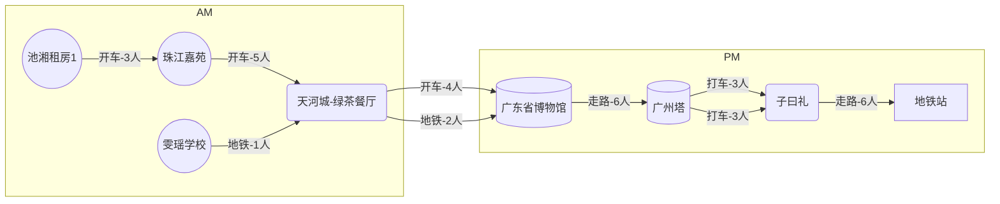

```mermaid
graph LR
subgraph AM
A((池湘租房1)) -->|开车-3人| B((珠江嘉苑))
B -->|开车-5人| C(天河城-绿茶餐厅)
F((雯瑶学校)) --> |地铁-1人|C
end
subgraph PM
C -->|开车-4人| D[(广东省博物馆)]
C -->|地铁-2人| D
D -->|走路-6人| E[(广州塔)]
E -->|打车-3人| G(子曰礼)
E -->|打车-3人| G
G -->|走路-6人| H[地铁站]
end
```






